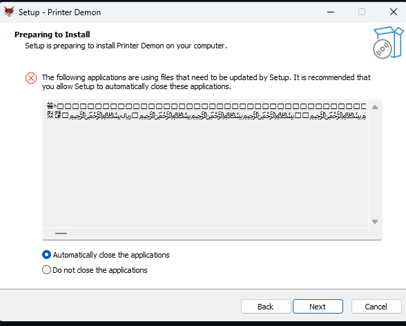

# Printer Demon

Borderless WPF drag-and-drop printer tile for the Xerox VersaLink C600 queue
`Xerox VersaLink C600 (8a:c6:4a)`.

## Requirements

- Windows x64
- An online Xerox VersaLink C600 queue
- A working driver installed for that queue
- The Xerox VersaLink C600 V4 PS driver configured on the exact queue

The app refuses to print when the target queue is missing or offline. It uses
the print settings saved on that exact Windows printer queue and never falls
back to another printer.

## Run

Run `PrinterDemon.exe` from this folder. No .NET installation is required.

To run the project from source with the .NET SDK:

```powershell
dotnet run --project .\PrinterDemon.csproj
```

## Install

Download and run `PrinterDemon-Setup.exe` from the latest GitHub release. The
installer adds Printer Demon to the Start Menu, optionally creates a desktop
shortcut, and registers an uninstaller in Windows Apps & features.

To remove all old installations and leftovers, run
`tools\Uninstall-All-PrinterDemon.ps1` in PowerShell and confirm with `YES`.

## Publish

The release includes Ghostscript under `tools/ghostscript/installed`, and the
runtime is also embedded in the EXE as a fallback. Ghostscript is the PDF
rendering engine used to convert dropped PDF pages into images before they are
sent to the printer. It is only needed for PDFs; JPG, PNG, TIFF, and BMP files
do not use it. The complete folder or ZIP is still recommended, but PDF support
can recover the embedded runtime if someone copies only the EXE.

Drop PDFs or JPG, JPEG, PNG, TIFF, or BMP files onto the tile. Jobs are sent
automatically using A4 media from Tray 1, while inheriting the printer's saved
settings for the remaining print options, with 400 DPI shrink-to-fit rendering
and high output quality.
The app does not add a print delay; it submits jobs immediately.
Additional files can be dropped while printing; they are appended to the
single ordered session queue and submitted as soon as the current spool
handoff completes. Multi-file drops are rendered concurrently and submitted
as one ordered bundle, while later drops remain separate ordered jobs.
For large drops, the app uses ordered bundles of up to eight files with at
most four files rendering concurrently, preventing memory spikes while
keeping printer jobs grouped.
